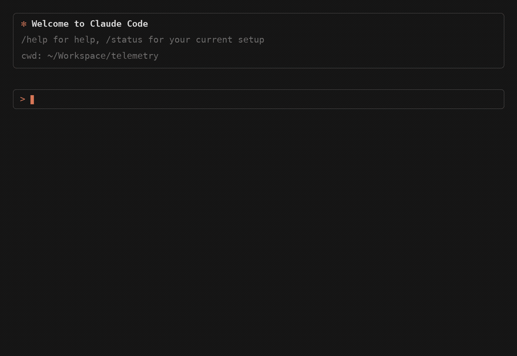

# Claude Telemetry

Capture Claude Code's OpenTelemetry output on your own machine, normalize it
into SQLite, and query it from inside Claude Code over MCP — what sessions
cost, which files they touched, what they shipped, and where the friction was.

**Nothing leaves this machine.** There is no model call anywhere in the
pipeline. Collection, normalization and every query run locally, and the
analysis is done by the agent you are already talking to, reading facts this
project only records.



_Every figure in that clip is real, queried out of the database this tool built
while building itself._

```
Claude Code
    │  OTLP/JSON over loopback :4318
    ▼
src/receiver.ts                       ── ~180 lines, node:http only
    │
    ├──▶ ~/.telemetry/raw/*.jsonl     ── append-only, verbatim, never rewritten
    │
    ▼
src/ingest.ts                         ── incremental, idempotent normalization
    │
    ▼
~/.telemetry/telemetry.db             ── SQLite, via node:sqlite
    │
    ├──▶ MCP server                   ── eight read-only tools, in every session
    └──▶ telemetry sql                ── ad-hoc queries
```

Zero runtime dependencies — `npm ls --prod` is empty. Node's standard library,
one background process, one SQLite file. No Docker, no collector image.

---

## Install

Requires **Node 22.5+** (for `node:sqlite`) and, optionally, `git` — without it
project mapping and commit reconciliation are skipped.

```bash
npm install -g @fatherjake/agent-telemetry
telemetry init      # settings, hooks, receiver, MCP, skill, first analyse
telemetry doctor    # optional: proves the pipeline end to end
```

Then **start a new Claude Code session** — Claude Code reads telemetry settings
at startup, so a session already running will not be captured.

Work normally for an hour, then ask Claude "what did that session cost?".

`init` is six steps. Each asks before it writes anything outside
`~/.telemetry`, and each is independently re-runnable, so stopping half way is
safe:

| Step | What it does                                 | Writes to                         |
| ---- | -------------------------------------------- | --------------------------------- |
| 1    | Points Claude Code at the local receiver     | `~/.claude/settings.json` (`env`) |
| 2    | Session hooks, for working-directory context | `~/.claude/settings.json` (hooks) |
| 3    | Starts the receiver on `localhost:4318`      | a background process              |
| 4    | Registers the MCP server, at user scope      | `~/.claude.json`                  |
| 5    | Installs the skill that makes Claude use it  | `~/.claude/skills/telemetry/`     |
| 6    | First analyse                                | `~/.telemetry/telemetry.db`       |

Install it rather than `npx` it: steps 1, 2 and 4 write this program's own path
into config files that have to keep working for months, and `npx` runs from a
cache npm is free to delete. `init` warns you if you try. `npx @fatherjake/agent-telemetry
status` and `... doctor` only read, so they are fine for a look first.

To undo all of it: `telemetry config uninstall` removes the env block, hooks,
skill and MCP registration; `telemetry stop` shuts the receiver down. Your data
in `~/.telemetry` is left alone.

From a checkout, `npm install` builds it; run it with
`node bin/telemetry.js <command>`, or `npm link` to put `telemetry` on your
PATH.

---

## What you get

Eight read-only MCP tools, in every Claude Code session on this machine:

| Tool                  | Answers                                                                                        |
| --------------------- | ---------------------------------------------------------------------------------------------- |
| `telemetry_overview`  | totals: period, spend, output, friction, what is attributable                                  |
| `telemetry_sessions`  | the unit of work, newest first: the prompt each opened on, cost, commits, corrections          |
| `telemetry_session`   | one session in full — turns, effort, commits, skills used, skills _not_ used, friction signals |
| `telemetry_friction`  | corrections, steers, rejects, tool failures, rework files                                      |
| `telemetry_inventory` | installed skills and MCP servers against what actually fired                                   |
| `telemetry_files`     | files read, written, created; never-opened files under a root                                  |
| `telemetry_schema`    | tables and columns, for writing SQL                                                            |
| `telemetry_sql`       | read-only SQL for anything the rest do not cover                                               |

Every one returns facts and counts. None returns a verdict — see
[Judgement lives in the caller](docs/design.md#judgement-lives-in-the-caller).

There is no terminal UI and no HTML report. The questions this data answers —
"what did that session cost", "which skill should have fired and didn't",
"where did the afternoon go" — come up _while working_, and the thing asking
them is already a model. It reads the facts and judges them on the spot.

The server reads `~/.telemetry/telemetry.db` directly and never touches the
receiver, so it answers whether or not anything is running. The connection is
opened read-only at the SQLite level: `telemetry_sql` cannot be talked into
writing, and neither can a bug.

---

## CLI

| Command                                              | Does                                                            |
| ---------------------------------------------------- | --------------------------------------------------------------- |
| `telemetry`                                          | same as `status`                                                |
| `telemetry init`                                     | guided first run: settings, hooks, receiver, MCP, first analyse |
| `telemetry install`                                  | point Claude Code at the local receiver                         |
| `telemetry start`                                    | start the OTLP receiver                                         |
| `telemetry stop`                                     | stop it                                                         |
| `telemetry status`                                   | running? events arriving? anything unanalysed?                  |
| `telemetry analyse`                                  | ingest new raw telemetry (incremental, idempotent)              |
| `telemetry install-skill`                            | install the skill that tells Claude which tool answers what     |
| `telemetry mcp [--register]`                         | serve the database to Claude Code                               |
| `telemetry sql "SELECT …"`                           | read-only query, `--json` for JSON                              |
| `telemetry doctor [--keep]`                          | end-to-end self test                                            |
| `telemetry config <privacy\|ignore\|env\|uninstall>` | everything that writes settings                                 |

`analyse` is safe to run as often as you like. Each raw file has a line cursor
and every row has a dedupe key, so nothing is counted twice. You rarely need
it by hand — the MCP server ingests anything new before it answers.

---

## What is in the package

| Path                | What it is                                                            |
| ------------------- | --------------------------------------------------------------------- |
| `src/receiver.ts`   | OTLP/JSON over loopback, appends each request verbatim to disk        |
| `src/ingest.ts`     | raw JSONL → normalized SQLite; incremental and idempotent             |
| `src/schema.sql`    | the database: tables, views and the indexes the back-fill depends on  |
| `src/queries.ts`    | every read query, shared by the CLI and the MCP server                |
| `src/mcp.ts`        | the eight tools, and JSON-RPC over stdin/stdout — no SDK              |
| `src/shellfiles.ts` | parses bash commands for file access the file tools never see         |
| `src/redact.ts`     | credential redaction and tool-argument minimisation                   |
| `src/gitctx.ts`     | read-only git: project identity, commit reconciliation                |
| `src/cli.ts`        | the `telemetry` command                                               |
| `skills/telemetry/` | the skill `init` installs, so Claude reaches for the tools unprompted |

Data lives in `~/.telemetry`, never in the checkout: one install serves every
project on the machine, and nothing sensitive sits inside a repository that
might get committed.

---

## Privacy

Everything Claude Code exports is stored, in full, on this machine only —
prompts, responses, tool arguments, API bodies. That is deliberate: a database
that knows a session cost $20 but not what it was asked to do cannot answer
"which skill should have fired here".

What is never stored is credentials. Every string is scrubbed on the way in,
and that has no off switch.

Nothing leaves this machine — no model call, no analytics, no egress. It is all
in `~/.telemetry`, and `rm -rf ~/.telemetry` puts it back to knowing nothing.
[PRIVACY.md](PRIVACY.md) is precise about what lands where.

---

## Development

```bash
npm install     # installs and builds
npm test        # 25 tests
npm run lint    # eslint
npm run format  # prettier
npm run check   # tsc --noEmit
```

A husky `pre-commit` hook runs `prettier --check` on staged files. See
[docs/development.md](docs/development.md) for what the lint rules are and why.

---

## Documentation

|                                                    |                                                               |
| -------------------------------------------------- | ------------------------------------------------------------- |
| [docs/design.md](docs/design.md)                   | how each number is arrived at, and which parts are inference  |
| [docs/configuration.md](docs/configuration.md)     | what Claude Code exports, ignore patterns, verifying it works |
| [docs/development.md](docs/development.md)         | building, tests, and the lint and format setup                |
| [docs/troubleshooting.md](docs/troubleshooting.md) | when nothing arrives, or arrives wrong                        |
| [docs/provenance.md](docs/provenance.md)           | where this came from, and the gaps in Claude Code's telemetry |
| [PRIVACY.md](PRIVACY.md)                           | everything that is and is not recorded                        |

---

## Licence

MIT.
